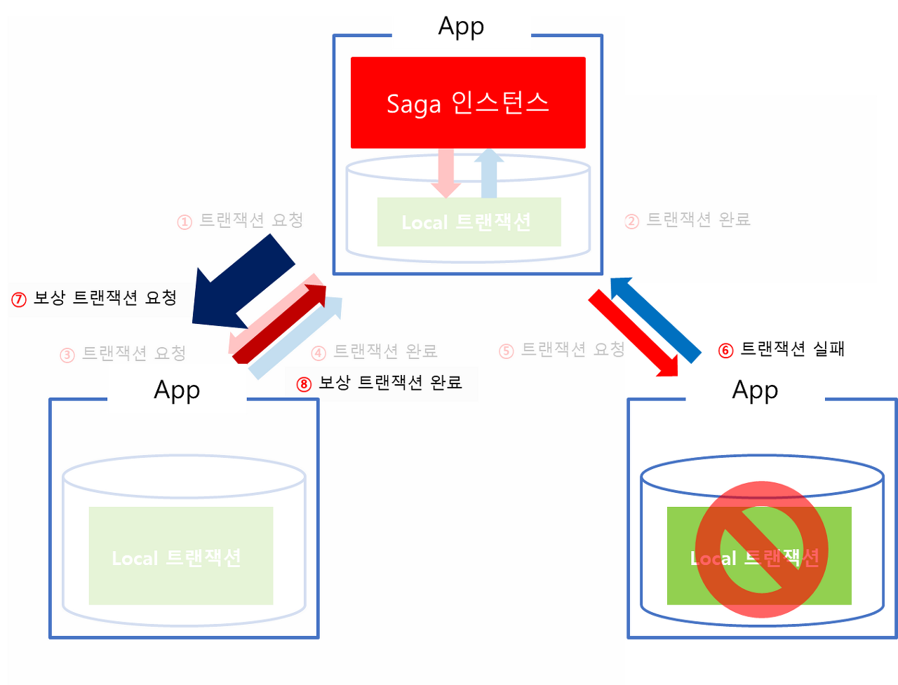
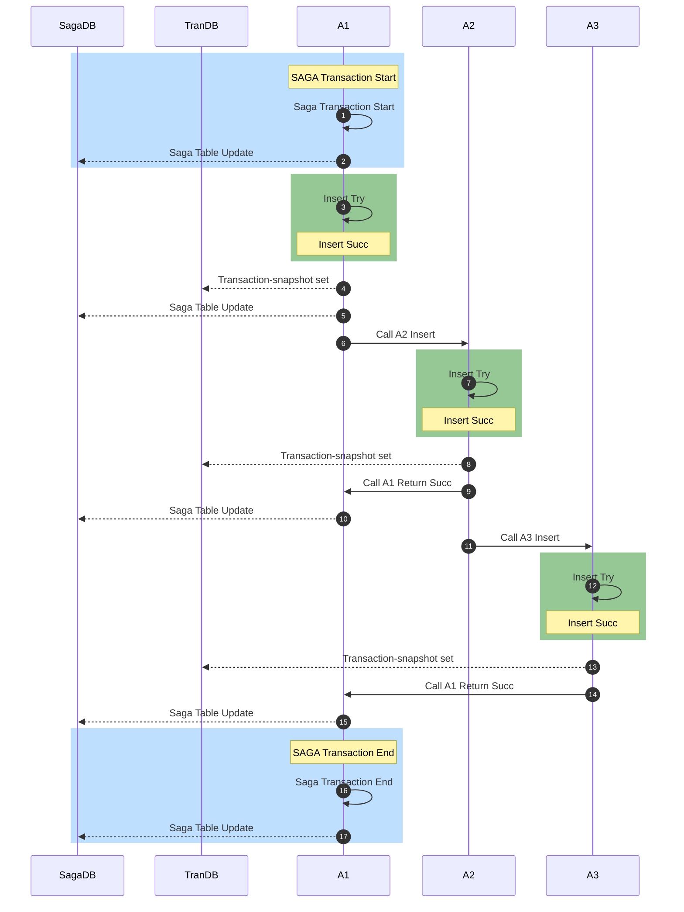
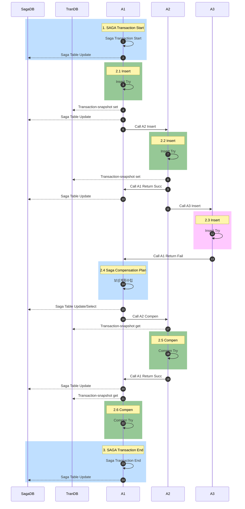
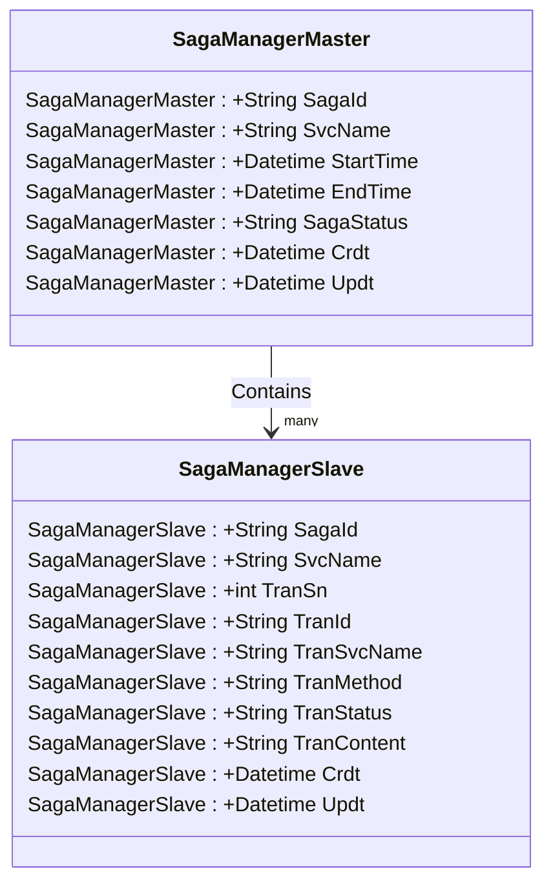

# Saga Pattern 분석

> 프로젝트에서 쉽게 적용 가능한 Saga Pattern Framwork 개발을 위한 분석

본 분석 문서는 개발자들의 최소한의 개발시간 투자로 Saga Pattern 을 적용한 Framwork 을 개발하기 위함이다.

- 몇가지 제약사항

  - Orchestration 기반의 SAGA 로 설계함

  - App과 App 사이의 호출관계는 동기방식(API Call)으로 고려한다.
    - 비동기 방식의 Call 여부는 차후 결정

# 1. Orchestration-Based Saga

Orchestration-Based Saga 패턴은 트랜잭션 처리를 위해 Saga 인스턴스(Manager)가 별도로 존재

트랜잭션에 관여하는 모든 App은 Manager에 의해 점진적으로 트랜잭션을 수행하며 결과를 Manager에게 전달하게 됨 

비지니스 로직상 마지막 트랜잭션이 끝나면 Manager를 종료해서 전체 트랜잭션 처리를 종료함 

만약 중간에 실패하게 되면 Manager에서 보상 트랜잭션을 발동하여 일관성을 유지함.

- 성공시

- 3번째 App 에서 실패시

# 2. Saga Pattern 설계

## 1.1 성공 시나리오

### 1) participant 설명

- SagaDB
  - mysql
  - Saga Manager 관리용도
  - Saga-Master Table 과 Saga-Slave Table 이 존재
  - Master
    - Sagahash-id 관리

  - Slave
    - Sagahash-id / Tranhash-id 를 관리
    - Redis 의 키값을 관리

- TranDB
  - Redis
  - 보상처리를 위해 DTO 형태를 그대로 저장
- A1: Application 1
  - Orchestration Based Saga 에서의 Manager 관리 App
- A2: Application 2
- A3: Application 3

### 2) Sequence Diagram

- Application A1, A2, A3 모두 Insert  처리되는 상황

### 3) Step 별 설명

1. Saga Transaction Start

   1. Sagahash-id 생성
   
2. Saga Table Update

   1. Sagamg-master Table insert

   

3. A1 Insert - insert 성공

4. Transaction snapshot set[Redis]

   1. A1 DTO 그대로 set

5. Saga State Update

   1. Saga Slave Insert (Sagahash-id / Tranhash-id 필요)

   

6. Call A2 Insert

   1. Sagahash-id 같이 전송  -- 어떻게 효과적으로 전송하나?

7. A2 Insert - insert 성공

8. Transaction snapshot set[Redis]

   1. A2 DTO 그대로 set

9. Call A1 Return Succ

   1. Sagahash-id / Tranhash-id / 성공여부 return

10. Saga State Update

    1. Saga Slave Insert (Sagahash-id / Tranhash-id 필요)

    

11. Call A3 Insert

    1. Sagahash-id 같이 전송  -- 어떻게 효과적으로 전송하나?

12. A3 Insert - insert 성공

13. Transaction snapshot set[Redis]

    1. A3 DTO 그대로 set

14. Call A1 Return Succ

    1. Sagahash-id / Tranhash-id / 성공여부 return

15. Saga State Update

    1. Saga Slave Insert (Sagahash-id / Tranhash-id 필요)

    

11. Saga Transaction End Process

17. Saga Table Update

    1. Sagamg-master Table End 로 Update

    

    

## 1.2 보상  시나리오

### 1) Sequence Diagram

- Application A1, A2 은 성공,  A3 에서 실패되는 시나리오

### 2) Step 별 설명

1. Saga Transaction Start
2. 성공 시나리오와 동일
3. 성공 시나리오와 동일
4. 성공 시나리오와 동일
5. 성공 시나리오와 동일
6. 성공 시나리오와 동일
7. 성공 시나리오와 동일
8. 성공 시나리오와 동일.
9. 성공 시나리오와 동일
10. 성공 시나리오와 동일
11. 성공 시나리오와 동일
12. 성공 시나리오와 동일
13. Call A1 Return Fail
14. 보상계획수립
    1. 실패시 보상처리 해야할 Transaction 을 slave 에 insert 한다.

15. Saga Table Update
    1. 보상트렌젝션 시작으로 Update
    2. 보상처리해야 할 서비스 중 첫번째 우서순위 Service Get

16. Call A2 Compen
    1. Sagahash-id / Tranhash-id / (CRUD) 전송

17. Transaction-snapshot get
    1. 보상처리하기 위해 Redis 로 부터 기 저장된 DTO 정보를 GET

18. A2 Compen Try
    1. 보상처리 시작
       1. C 였으면 D 로
       2. D 였으면 C 로
       3. U 였으면 이전 값으로 U 처리한다.

19. Saga Table Update
20. Saga Transaction End
21. Transaction-snapshot get
22. A1 Compen Try
23. Saga Table Update
24. Saga Transaction End
25. Sagamg-master Table End 로 Update

# 3. Saga Manager

Saga Manager 는 일반 RDB(Mysql 등) 를 통해 관리한다.

## 1.1 Saga Manager ER

## 1.2 Structure

### 1) SagaManager Master

| SagaId         | SvcName | StartTime        | EndTime          | SagaStatus | Crdt                 | Updt                 |
| -------------- | ------- | ---------------- | ---------------- | ---------- | -------------------- | -------------------- |
| sagahash-00001 | A1      | 2022-07-09 12:00 | 2022-07-09 12:10 | E          | 2022-07-09- 12:00:00 | 2022-07-09- 12:00:00 |

- SagaStatus

| SagaStatus | Description |
| ---------- | ----------- |
| S          | 시작        |
| P          | 처리중      |
| E          | 종료        |
| CP         | 보상처리중  |
| CE         | 보상종료    |

### 2) SagaManager Slave

| SagaId         | SvcName | TranSn | TranId         | TranSvcName | TranMethod | TranStatus | TranContent | Crdt                 | Updt                 |
| -------------- | ------- | ------ | -------------- | ----------- | ---------- | ---------- | ----------- | -------------------- | -------------------- |
| sagahash-00001 | A1      | 1      | tranhash-00001 | A1          | C          | End        |             | 2022-07-09- 12:00:00 | 2022-07-09- 12:00:00 |
|                |         | 2      | tranhash-00002 | A2          | C          | End        |             | 2022-07-09- 12:01:00 | 2022-07-09- 12:01:00 |
|                |         | 3      | tranhash-00003 | A3          | C          | End        |             | 2022-07-09- 12:02:00 | 2022-07-09- 12:02:00 |

- TranMethod

| TranMethod | Description |
| ---------- | ----------- |
| C          | Insert      |
| R          | Select      |
| U          | Update      |
| D          | Delete      |

- TranStatus

| SagaStatus | Description |
| ---------- | ----------- |
| Init       |             |
| Process    | 처리중      |
| End        | 종료        |
| Fail       | 실패        |

## 1.3 보상사례 Data

- Master

| SagaId         | SvcName | StartTime        | EndTime          | SagaStatus | Crdt                 | Updt                 |
| -------------- | ------- | ---------------- | ---------------- | ---------- | -------------------- | -------------------- |
| sagahash-00002 | A1      | 2022-07-09 12:00 | 2022-07-09 12:10 | CS         | 2022-07-09- 12:00:00 | 2022-07-09- 12:00:00 |

- Slave

| SagaId         | SvcName | TranSn | TranId         | TranSvcName | TranMethod | TranStatus | TranContent | Crdt                 | Updt                 |
| -------------- | ------- | ------ | -------------- | ----------- | ---------- | ---------- | ----------- | -------------------- | -------------------- |
| sagahash-00002 | A1      | 1      | tranhash-00001 | A1          | C          | End        |             | 2022-07-09- 12:00:00 | 2022-07-09- 12:00:00 |
|                |         | 2      | tranhash-00002 | A2          | C          | End        |             | 2022-07-09- 12:01:00 | 2022-07-09- 12:01:00 |
|                |         | 3      | tranhash-00003 | A3          | C          | Fail       |             | 2022-07-09- 12:02:00 | 2022-07-09- 12:02:00 |
|                |         | 4      | tranhash-00002 | A2          | D          |            |             | 2022-07-09- 12:03:00 |                      |
|                |         | 5      | tranhash-00001 | A1          | D          |            |             | 2022-07-09- 12:03:00 |                      |
